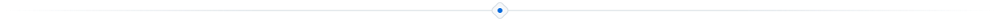
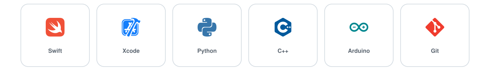

<!--
  Graphics live in /assets and are plain SVG files in this repo.
  No service to call, nothing to generate, nothing that can rate-limit.
  Each has a light and a dark version; GitHub swaps them automatically.
-->

<picture>
  <source media="(prefers-color-scheme: dark)" srcset="assets/banner-dark.svg" />
  <source media="(prefers-color-scheme: light)" srcset="assets/banner-light.svg" />
  
</picture>

  
  
  
  

<picture>
  <source media="(prefers-color-scheme: dark)" srcset="assets/divider-dark.svg" />
  <source media="(prefers-color-scheme: light)" srcset="assets/divider-light.svg" />
  
</picture>

## 🔨 &nbsp;Now

Building **RecipeApp**, a SwiftUI app for saving and scaling recipes. It's my main
project this term and the reason I'm learning Swift properly rather than copying
tutorials. Right now I'm working through Core Data and Swift concurrency.

Open to collaborating on beginner-friendly iOS or Arduino projects — if you're
building something in that space, message me.

<picture>
  <source media="(prefers-color-scheme: dark)" srcset="assets/divider-dark.svg" />
  <source media="(prefers-color-scheme: light)" srcset="assets/divider-light.svg" />
  
</picture>

## 📦 &nbsp;Projects

<!--
  To add a project: copy one <td> block and edit the four lines inside it.
  Keep two <td> blocks per <tr> so the grid stays even.
  Only link repos that actually exist, or the button will 404.
-->

<table>
<tr>

<td width="50%" valign="top">
<h3 align="center">🌙 &nbsp;Goodnight</h3>

<em>One line on what it does — replace this.</em>

  
  

  

</td>

<td width="50%" valign="top">
<h3 align="center">🗂️ &nbsp;Portfolio</h3>

<em>Everything I've built, in one place.</em>

  
  

  

</td>

</tr>
</table>

<picture>
  <source media="(prefers-color-scheme: dark)" srcset="assets/divider-dark.svg" />
  <source media="(prefers-color-scheme: light)" srcset="assets/divider-light.svg" />
  
</picture>

## 🧰 &nbsp;What I work with

<picture>
  <source media="(prefers-color-scheme: dark)" srcset="assets/stack-dark.svg" />
  <source media="(prefers-color-scheme: light)" srcset="assets/stack-light.svg" />
  
</picture>

<picture>
  <source media="(prefers-color-scheme: dark)" srcset="assets/divider-dark.svg" />
  <source media="(prefers-color-scheme: light)" srcset="assets/divider-light.svg" />
  
</picture>

## 🐈 &nbsp;About me

I got into programming through tinkering with Arduino — hardware that blinks is a very
good motivator when you're eleven and nothing else you write does anything visible. That
turned into Python, then into iOS once I realised I could build things I'd actually carry
around with me.

I like projects where the result is tangible: an app I can hand to someone, a script that
saves me an hour of homework admin, a circuit that does one small thing well. Most of what's
in these repos is me learning in public, which means some of it is rough. I'd rather have it
public and improving than polished and hidden.

Outside of code I'm at British International School HCMC, and I have five cats.

<picture>
  <source media="(prefers-color-scheme: dark)" srcset="assets/divider-dark.svg" />
  <source media="(prefers-color-scheme: light)" srcset="assets/divider-light.svg" />
  
</picture>

## 👋 &nbsp;Say hello

**tony@pnholdings.com** · [@babydevourer](https://twitter.com/babydevourer) on X

Happy to talk about Swift, Arduino, school projects, or the cats.

  

